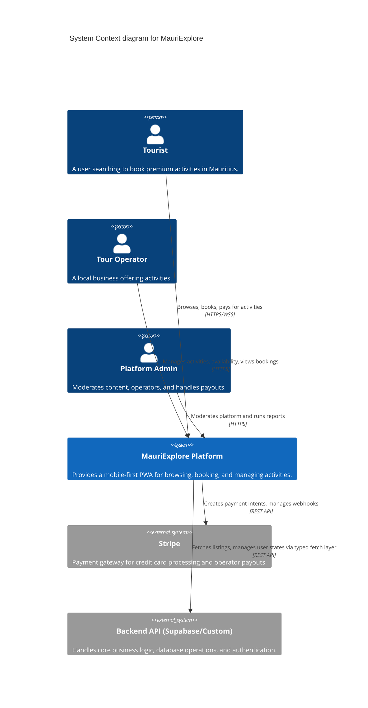
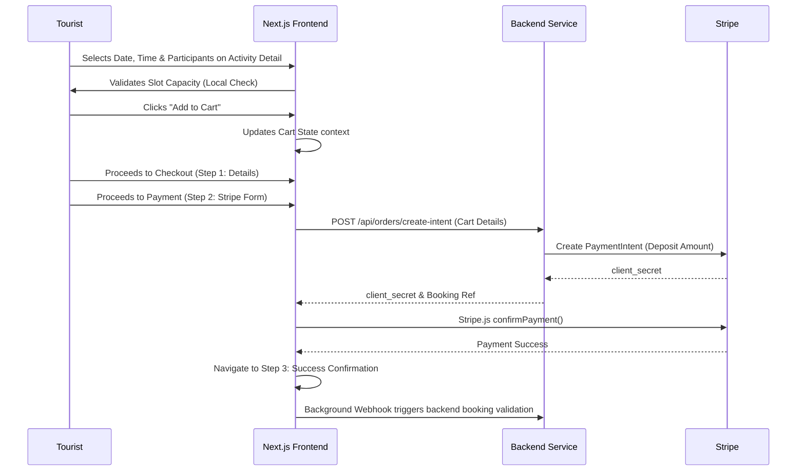
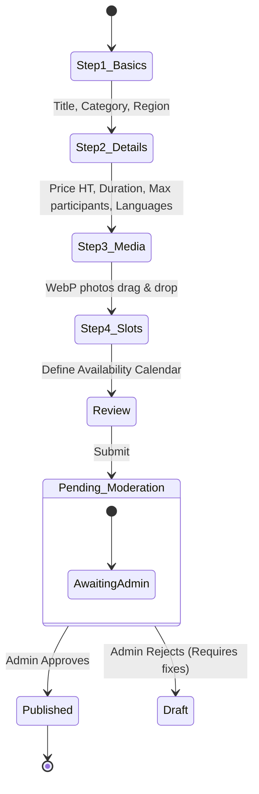

# MauriExplore - Architecture Document

> [!NOTE]
> This document outlines the architectural vision, technology stack, and core workflows for **MauriExplore**, a mobile-first premium PWA tourism marketplace for Mauritius.

## 1. System Context Architecture

MauriExplore acts as a broker between Tourists seeking luxury experiences, Local Operators providing them, and Admins managing the platform.



## 2. Frontend Architecture (Next.js Application)

The frontend uses **Next.js App Router** with a highly segregated directory structure to cleanly separate public marketing pages from authenticated domain areas.

```mermaid
graph TD
    subgraph "App Router (app/)"
        Layout("Root Layout & Providers (Theme, Locale)")
        
        subgraph "(public)"
            Home("/")
            Activities("/activities")
            SEO_Landing("/[activity-type]-ile-maurice")
            Blog("/blog")
        end
        
        subgraph "(auth)"
            Login("/login")
            Register("/register")
        end
        
        subgraph "Checkout Domain"
            Cart("/cart")
            Checkout("/checkout")
        end
        
        subgraph "Dashboard Domain"
            TouristAcc("/account")
            OperatorDash("/dashboard/operator")
            AdminDash("/dashboard/admin")
        end
    end
    
    Layout --> |Public routing| (public)
    Layout --> |Middleware Protected| (auth)
    Layout --> |Middleware Protected| Checkout Domain
    Layout --> |Middleware Protected| Dashboard Domain
```

### 2.1 Tech Stack Highlights
- **Core Strategy**: Mobile-First Progressive Web App (PWA). PWA Cache-first for static assets.
- **Framework**: Next.js 14+ (React 19).
- **Styling**: Tailwind CSS v4 with custom tokens + standard vanilla CSS micro-interactions.
- **Icons**: Lucide React.
- **i18n**: `next-intl` handling FR, EN, DE, ES, RU dynamically via routing schemas.
- **SEO Optimization**: Component-driven structured data (`BreadcrumbJSON`, `ActivitySchema`, `ArticleSchema`) injected dynamically.

> [!TIP]
> **Component Library Approach**: We are utilizing highly reusable components built initially via V0, then structured strictly into `/layout`, `/ui`, `/seo`, `/forms`, and `/dashboard` folders. 

## 3. Core Transaction Flows

### 3.1 Checkout & Booking Flow

The most critical path of the application is the conversion funnel from activity selection to a confirmed paid booking.



### 3.2 Operator Activity Creation Flow

Operators must go through a rigid, multi-step process to ensure data quality on the marketplace.



## 4. UI/UX Rules & Design System

The system applies stringent "Luxury" UI constraints aimed at inspiring trust and ensuring optimal mobile usability. 

- **Skeletons Everywhere**: Async boundaries use skeleton loaders preventing Cumulative Layout Shift (CLS).
- **Touch Areas**: Minimum `48x48px` enforce strict mobile compliance.
- **Micro-Animations**: Framer Motion is specifically reserved for page routing transitions to give an "App-like" feel, whereas standard interactions (buttons) use CSS for performance.
- **Glassmorphism Layering**: Employed defensively strictly over hero components and floating navigations.
- **Colors**: Turquoise (`#06B6D4`) as the Call to Value, Gold (`#D4AF37`) specifically for conversion points and price focus points.

> [!IMPORTANT]
> Since direct database integration is disallowed from the UI, **all** state updates and queries are decoupled via strict TypeScript-defined `fetch` calls mirroring the type signatures found in `types/` (such as `ActivityFull` and `CartItem`).
