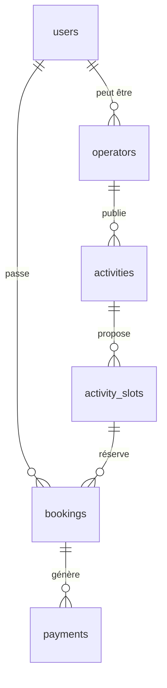

# MauriExplore — Plan Backend complet

> [!NOTE]
> État actuel : le frontend est **100 % mock**. Aucune route API (`app/**/route.ts` inexistant), aucune auth, aucune base.
> Toute la donnée vient de `MOCK_ACTIVITIES` / `MOCK_CART_ITEMS` dans `lib/hooks/useActivities.ts` et `lib/hooks/useCart.ts`.
> Ce document définit la stack cible et le chemin de migration.

---

## 1. Stack retenue

| Couche | Choix | Pourquoi |
|--------|-------|----------|
| Runtime API | **Next.js 16 Route Handlers + Server Actions**, runtime **Node.js** (Fluid Compute) | Pas de service séparé à opérer. Fluid réutilise les instances → cold starts faibles. **Ne pas utiliser `runtime = 'edge'`** : Stripe SDK et le driver Postgres veulent Node.js. |
| Base | **Neon Postgres** | Serverless, scale-to-zero, branching par PR (une branche Neon = un env de preview Vercel). |
| Accès DB | **Drizzle ORM** + `@neondatabase/serverless` | Typage TS de bout en bout, migrations SQL lisibles et versionnées, bundle léger. Prisma reste jouable mais son moteur pèse plus en serverless. |
| Validation | **Zod** (déjà installé) | Un schéma unique partagé entre le `Route Handler`, le formulaire `react-hook-form` et les types métier. |
| Auth | **Auth.js v5** + adapter Drizzle | Sessions DB, OAuth Google, RBAC 3 rôles. Alternative crédible : Better Auth. |
| Paiement | **Stripe** (PaymentIntent) + **Stripe Connect** | Connect est nécessaire pour reverser les opérateurs (`/operator/wallet` existe déjà en UI). |
| Fichiers | **Vercel Blob** | Photos WebP des activités (flux opérateur étape 3). |
| Email | **Resend** | Confirmations de réservation, emails opérateur. |
| Jobs | **Vercel Cron** | Expiration des réservations à 15 min (voir `STATE-001`). |

### Décisions structurantes

- **Aucun accès DB depuis un composant client.** Conforme à `ARCHITECTURE.md §4` : tout passe par des Route Handlers typés.
- **Le paiement n'est jamais validé sur un retour frontend** — uniquement via webhook Stripe (`ADR-001`). C'est la décision la plus importante du backend.
- **L'inventaire (places restantes) est la seule vraie ressource critique en concurrence.** Il exige un verrou transactionnel, détaillé en §4.

---

## 2. Modèle de données

Dérivé de `types/activity.ts`, `types/cart.ts` et `CLASS-001`.



### Tables

**`users`** — `id uuid pk`, `email citext unique`, `name`, `avatar_url`, `role user_role not null default 'tourist'`, `locale`, `created_at`.
`user_role` = enum `('tourist','operator','admin')`.

**`operators`** — `id uuid pk`, `user_id fk unique`, `display_name`, `verified bool default false`, `stripe_account_id`, `payout_enabled bool`.
Alimente `ActivityOperator`.

**`activities`** — `id uuid pk`, `operator_id fk`, `slug citext unique`, `title`, `category`, `region`, `duration`, `price_ht numeric(10,2)`, `max_participants int`, `languages text[]`, `image_urls text[]`, `included text[]`, `excluded text[]`, `description jsonb` (clés `fr|en|de|es|ru`), `status activity_status default 'draft'`, `rating numeric(2,1)`, `review_count int default 0`.
`activity_status` = `('draft','pending_moderation','published','rejected')` — reprend la machine du flux opérateur.

> `priceFrom` du type `Activity` est **dérivé**, pas stocké : c'est le min des prix effectifs. À exposer via une vue ou un calcul au mapping.

**`activity_slots`** — `id uuid pk`, `activity_id fk`, `starts_at timestamptz`, `max_spots int`, `spots_taken int not null default 0`, `unique (activity_id, starts_at)`.

> **Stocker `spots_taken`, pas `spotsLeft`.** `spotsLeft` se calcule (`max_spots - spots_taken`) et s'expose au front. Un compteur qui ne fait qu'augmenter est bien plus sûr en concurrence, et permet la contrainte `check (spots_taken <= max_spots)` qui rend la survente **structurellement impossible**.

**`bookings`** — `id uuid pk`, `booking_ref text unique` (format `MX-2026-000123`), `user_id fk`, `slot_id fk`, `participants int check (participants > 0)`, `total_price numeric`, `deposit_due numeric`, `balance_due_on_site numeric`, `status booking_status`, `stripe_payment_intent_id`, `expires_at timestamptz`, `created_at`.
`booking_status` = `('pending_payment','confirmed','expired','cancelled','completed')` — strictement `STATE-001`.

**`payments`** — `id uuid pk`, `booking_id fk`, `stripe_payment_intent_id unique`, `amount numeric`, `currency`, `status`, `raw jsonb`.

**`processed_stripe_events`** — `event_id text pk`, `processed_at timestamptz`.
> Table d'idempotence. Stripe rejoue ses webhooks ; sans elle, un rejeu double-confirme une réservation. C'est le trade-off négatif explicitement accepté dans `ADR-001`.

### Index à ne pas oublier
```sql
create index on activities (status, region, category);   -- filtres de /activities
create index on activity_slots (activity_id, starts_at);
create index on bookings (user_id, created_at desc);
create index on bookings (status, expires_at);           -- balayage du cron d'expiration
```

---

## 3. Surface d'API

| Méthode | Route | Rôle | Remplace |
|---------|-------|------|----------|
| GET | `/api/activities` | public | `useActivities()` mock — filtres `ActivityFilters`, renvoie `ActivitiesResponse` |
| GET | `/api/activities/[slug]` | public | renvoie `ActivityFull` + slots |
| POST | `/api/orders/create-intent` | tourist | `API-001` — crée booking + PaymentIntent |
| POST | `/api/webhooks/stripe` | Stripe | confirme la réservation |
| GET | `/api/bookings` | tourist | `useCart()` mock bookings |
| POST | `/api/bookings/[id]/cancel` | tourist | |
| GET/POST/PATCH | `/api/operator/activities` | operator | flux création 4 étapes |
| GET | `/api/operator/bookings` | operator | `/operator/bookings` |
| GET | `/api/operator/stats` | operator | `/operator/dashboard` |
| POST | `/api/admin/activities/[id]/moderate` | admin | approve / reject |
| GET | `/api/cron/expire-bookings` | cron | libère les places à 15 min |

> **Le panier reste côté client** (localStorage). Il ne devient serveur qu'au `create-intent`. Inutile de persister un panier anonyme au MVP.

---

## 4. Le flux critique : `create-intent`

C'est le seul endroit où la correction du système est vraiment en jeu.

```
BEGIN;
  SELECT ... FROM activity_slots WHERE id = $1 FOR UPDATE;   -- verrou ligne
  -- refus si spots_taken + participants > max_spots
  UPDATE activity_slots SET spots_taken = spots_taken + $participants;
  INSERT INTO bookings (status, expires_at) VALUES ('pending_payment', now() + interval '15 minutes');
COMMIT;
-- puis seulement : Stripe.paymentIntents.create()
```

Trois points non négociables :

1. **`SELECT ... FOR UPDATE`** sérialise deux touristes qui visent la dernière place. Sans lui, les deux passent.
2. **Les places sont réservées *avant* l'appel Stripe**, pas après. On préfère bloquer une place 15 min pour rien (le cron la libère) que vendre deux fois la même.
3. **Le montant est recalculé côté serveur** depuis `activities.price_ht` — jamais lu depuis la requête client. `RULE-001` : `deposit_due = round(total * 0.20, 2)`, `balance_due_on_site = total - deposit_due`.

### Webhook
Sur `payment_intent.succeeded` : vérifier la signature (`STRIPE_WEBHOOK_SECRET`), insérer dans `processed_stripe_events` (un conflit = rejeu, on sort en `200`), puis passer le booking `pending_payment → confirmed`. Répondre `200` vite ; l'email part en tâche de fond.

### Cron d'expiration
`GET /api/cron/expire-bookings`, toutes les 5 min : pour chaque booking `pending_payment` dont `expires_at < now()`, décrémenter `spots_taken` et passer à `expired` — dans une transaction.

---

## 5. Auth & RBAC

- Auth.js v5, sessions en base via l'adapter Drizzle.
- Google OAuth + magic link email (le touriste international n'a pas envie de créer un mot de passe).
- `middleware.ts` protège `/account`, `/bookings`, `/checkout`, `/operator/*`.
- **Le rôle se vérifie systématiquement côté serveur dans chaque handler**, jamais uniquement dans le middleware — un opérateur ne doit voir que ses propres réservations. Le filtre `operator_id = session.operatorId` est la ligne de défense réelle.

---

## 6. Variables d'environnement

```
DATABASE_URL=                  # Neon, pooled
DATABASE_URL_UNPOOLED=         # migrations Drizzle
AUTH_SECRET=
AUTH_GOOGLE_ID= / AUTH_GOOGLE_SECRET=
STRIPE_SECRET_KEY=
STRIPE_WEBHOOK_SECRET=
NEXT_PUBLIC_STRIPE_PUBLISHABLE_KEY=
BLOB_READ_WRITE_TOKEN=
RESEND_API_KEY=
CRON_SECRET=
NEXT_PUBLIC_SITE_URL=          # corrige aussi le warning metadataBase du build
```

---

## 7. Phasage

**Phase 0 — Fondations.** Neon + Drizzle, schéma, migrations, seed depuis les mocks existants (les données de `MOCK_ACTIVITIES` deviennent le seed : rien n'est perdu, la page ne bouge pas).

**Phase 1 — Lecture.** `/api/activities` + `[slug]`. On réécrit `useActivities` pour `fetch` au lieu de retourner le mock. **La signature du hook ne change pas** — c'est ce qui rend la bascule indolore, les composants ne sont pas touchés.

**Phase 2 — Auth.** Auth.js, middleware, rôles, branchement de `AuthForm.tsx`.

**Phase 3 — Réservation & paiement.** `create-intent`, Stripe Elements dans `/checkout`, webhook, cron d'expiration. **C'est la phase à risque** : à faire en mode test Stripe, avec les scénarios Gherkin de `RULE-001` en tests d'intégration.

**Phase 4 — Espace opérateur.** CRUD activités, upload Blob, modération admin.

**Phase 5 — Payouts.** Stripe Connect, `/operator/wallet`.

---

## 8. Points d'attention

- **`spotsLeft` vs `spots_taken`** : le front consomme `spotsLeft`, la base stocke `spots_taken`. Faire la conversion dans une seule fonction de mapping pour éviter les divergences.
- **`description` multilingue** en `jsonb` : le front la type `Record<'fr'|'en'|'de'|'es'|'ru', string>`, donc valider les 5 clés à l'écriture sous peine de casser l'affichage.
- **i18n absent** : `next-intl` est prévu dans `ARCHITECTURE.md` mais n'est pas installé. À trancher avant la Phase 4, car le routing localisé change les URLs — donc le SEO et les slugs.
- **Prix en `numeric`, jamais en `float`.** Et côté Stripe, montants en **centimes entiers**.
- **Branches Neon par preview** : une branche DB par PR évite qu'un test de paiement en preview pollue la prod.

---

## 9. Ce que ce plan ne couvre pas

Avis, messagerie touriste↔opérateur, annulation avec remboursement partiel, multi-devises (tout est en EUR), et le blog/SEO landing pages évoqués dans `ARCHITECTURE.md §2`.
